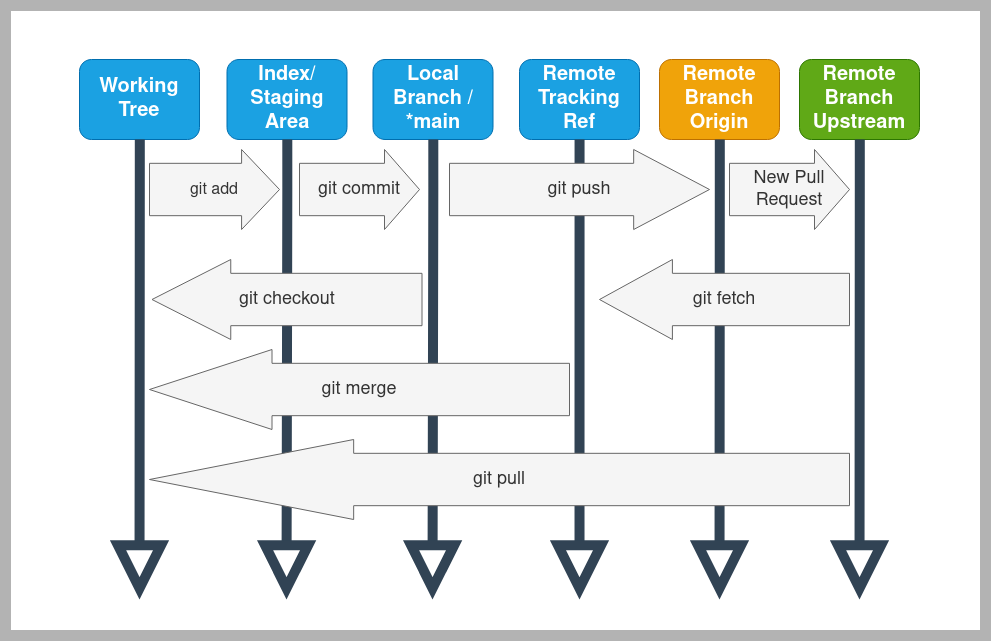
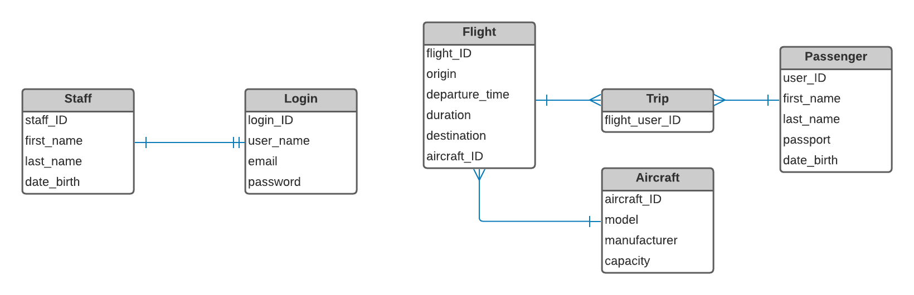
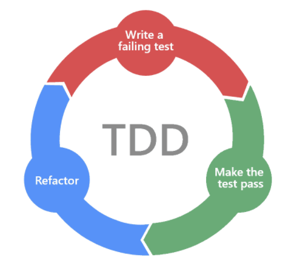

# Airport App

Python Project for SpartaGlobal Engineering 84 DevOps Stream.

## Table of Contents

- [User Stories](#user-stories)
- [Documentation](#documentation)
- [Gitflow](#gitflow)
- [Project Structure](#project-structure)
- [Entity Relationship Diagram](#entity-relationship-diagram)
- [TDD](#test-driven-development)


## User Stories

- As an airport assistant, I want to be to create passengers with name AND passport number, so that I can add them flight.
- As an airport assistant, I want to be able to assign or change flight destinations or departure dates with user passwords.
- As an airport assistant, I want to create a flight trip with a specific destination.
- As an airport assistant, I want to be able to generate a flight_attendees_list_report that lists passengers' names and passports to check identity.
- As an airport assistant, I want to be able to add passengers to a flight so I can sell tickets to them

## Documentation

Prerequisites:

- python 3.7+
- git cli

To work on the project, clone it in your local machine:

```bash
git clone https://github.com/conjectures/eng84-airport-project.git
```

Change directory to the downloaded folder:

```bash
cd eng84-airport-project
```

It is highly recommended to use a virtual environment to install the python packages.

When the virutal environment is activated, run

```bash
python -m pip install -r requirements.txt
```

> _Note: Might need to substitude `python` with `python3` in certain linux distributions. If `python --version` outputs a python version of 3.x+ then the above snippet will work properly._

After all the requirements are installed, the app will be almost ready to run. Change directory to the `app/` folder, then enter the following commands sequentially.

```bash
python manage.py makemigrations
python manage.py migrate
```

As the database is not tracked in the github repository, you need to create a new `sqlite3` database on your machine. With the above commands, the database is initialised with the models required.

If you already have a previous version of the project, some conflicts will arise with the database. It might be more beneficial to remove `db.sqlite3` and try again, if the issue cannot be resolved via the commandline.

After the migrations are complete, it is time to run the project on a localhost:

```bash
python manage.py runserver
```

The above command will run a localhost server on port 8000 on your machine. To view the app, open any browser and type on the URL `127.0.0.1:8000` or `localhost:8000` for your convenience.

## Project Structure

The project is organised as follows:

```python
# Repository folder. Contains all project files.
eng84-airport-project/
  # Files required for git tracking
  .git/
  ...
  ...
  # Files for the Django project
  app/
    # Temporary database
    db.sqlite3
    # Django App 'starter' file
    manage.py
    # Project files and settings are stored here:
    airportapp/
      ...
      ...
      settings.py
    # All the functionality is stored here.
    core/
      ...
      ...
      ...
      # The html templates are stored here.
      templates/
```

## Gitflow



## Projects contribution workflow

1. Fork the repo from the following address => `https://github.com/conjectures/eng84-airport-project`
2. Clone the `forked` repo to your local machine (use ssh address) => `git clone <url>`
3. Add the main repo with an alias. By convention should be called `upstream` =>
   `git remote add upstream git@github.com:conjectures/eng84-airport-project.git`

You should have 4 configured remote repo 2 for your forked repo as `origin` and 2 for the main repo as `upstream`. Check by running => `git remote -v`

4. If you create a *feature* branch remember to merge it into the main branch, before pushing it to `github`
5. After you've completed your contribution you can push it to your forked repo
<pre>
   1 `git add . `
   2 `git commit -m "comment"`
   3 `git push -u origin main`
</pre>
6. Next go to the forked repo on your account and on the main page you'll find a button `New pull request`, use it to ask for your contribution to be accepted
7. Lastly Alexis should accept the `pull request` and merge it with the main repo
8. To have the latest update of the repo do a `git pull` from the main repo =>
   `git pull upstream` (this command will overwrite the current repo with the updated one)

- The safe way would be to
  `git fetch upstream` first, and then
  `git merge upstream/main`

## Entity Relationship Diagram



Our diagram is based on the User stories as well as on the different functionalities that our interface will cover.
Django’s model makes use of a powerful ORM layer which simplifies dealing with the database and the data and accelerates the development process. Easy Database Migrations and easy database management. Our database is structured for the following tables:
- On one hand we have the entity of staff and login that have a one-to-one relationship because each user has their own login details and does not belong to anyone else. Database allows you to create whatever you want but we will restrict from people some functions. For that reason we have these two entities in the backend so that only we can control it.
- On the other hand we have the entities of flight and user, which is a many-to-many relationship since a user can have several flights and a flight can have several users. The last entity that we have is aircraft that has a relationship of one to many for the reason that an airplane can be assigned to different flights but a flight can only have one airplane for the trip obviously. These entities are the ones that will be used the most depending on the assistant and the functionalities and thanks that django is going to generate the database automatically with which we can migrate it and make use of it, and this is the reason that we have it separated.

Much appreciated to the chart we were able to center on the concept of OOP. It made a difference us choose how numerous classes we are planning to need to make, what attributes and methods each of these objects will have, and in this way we are able reuse the code within the diverse pages without having to rehash it. As a result of the ERD, code with OOP plan is adaptable, measured, and abstract.

## Test Driven Development

One of the requirements of the project was the use of the TDD software. Test-driven development is a software development process relying on software requirements being converted to test cases before software is fully developed. In simple terms, test cases for each functionality are created and tested. In the following image we proceed to see how the life cycle is:



- TDD cycle start with everything failing - RED
- Write code to pass the test - GREEN
- Refactor the code for the next test - BLUE
- This continues until all the test have successfully passed.

For the reason that at the time of implementation, the different developers have carried out the implementation of each functionality separately, in such a way that with TDD it has been easier for us to test each of the functionalities in the backend before proceeding to merge the code of each of the developers. TDD helps reduce the unexpected errors and the code becomes clearer and simple to understand. It's like an API Feedback. In such a way that when we have all the code together, all this information can solve future problems, we will save time and cost of the product and the code will be much cleaner.

We will use Pytest unittest in Python to implement TDD.

Let's proceed to create an example:

- We proceed to create an instance of the passenger class in a manner that we insert its data into the database. We proceed to carry out the test with the test_passenger method in which we compare each of the passenger's attributes, but in the case of the passport we proceed to compare it with a different passport.
````python
from django.test import TestCase
from ..models import Passenger
# We will run tests for Person, Staff and Passenger
class PassengerTestCase(TestCase):

    # Let's define the objects that we will test if they have been added in the database
    def setUp(self):
        Passenger.objects.create(first_name="Paul", last_name="Kane", dob="1994-06-14", passport_num="123456ABC")
    
        def test_passenger(self):
        passenger1 = Passenger.objects.get(id=5)
        self.assertEqual(passenger1.first_name, "Paul")
        self.assertEqual(passenger1.last_name, "Kane")
        self.assertEqual(str(passenger1.dob), "1994-06-14")
        self.assertEqual(passenger1.passport_num, "456789QWE")
````

- We proceed to run the test.
````
(venv) C:\Users\alfonso\PycharmProjects\eng84_Airport_Project\eng84-airport-project\app>python manage.py test
Creating test database for alias 'default'...
System check identified no issues (0 silenced).
F
======================================================================
FAIL: test_passenger (core.tests.test_passenger.PassengerTestCase)
----------------------------------------------------------------------
Traceback (most recent call last):
  File "C:\Users\alfonso\PycharmProjects\eng84_Airport_Project\eng84-airport-project\app\core\tests\test_passenger.py", line 32, in test_passenger
    self.assertEqual(passenger1.passport_num, "456789QWE")
AssertionError: '123456ABC' != '456789QWE'
- 123456ABC
+ 456789QWE


----------------------------------------------------------------------
Ran 1 test in 0.050s

FAILED (failures=1)
Destroying test database for alias 'default'...
````

- We proceed to write the code correctly so that it passes the test:
````python
self.assertEqual(passenger1.passport_num, "123456ABC")
````

- We can see that the test has been passed successfully.
````
(venv) C:\Users\alfonso\PycharmProjects\eng84_Airport_Project\eng84-airport-project\app>python manage.py test
Creating test database for alias 'default'...
System check identified no issues (0 silenced).
.
----------------------------------------------------------------------
Ran 1 test in 0.013s

OK
Destroying test database for alias 'default'...
````